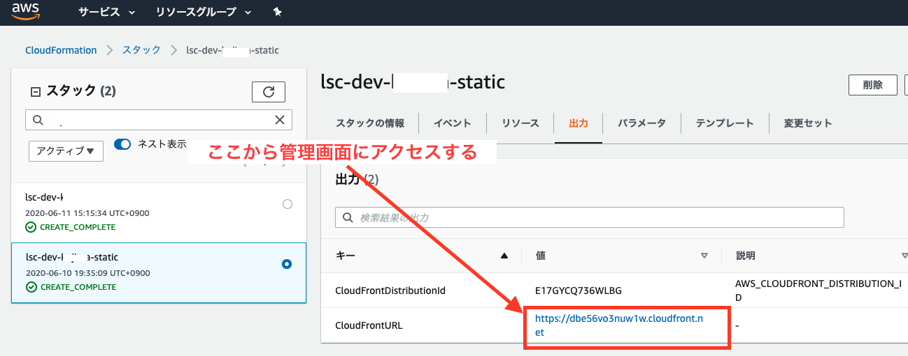

# LINE SMART CITY


[](https://linefukuoka.co.jp/ja/project/smartcityproject/govtech/)

## 「LINE SMART CITY GovTechプログラム」とは？
「LINE SMART CITY GovTechプログラム」とは、LINE公式アカウント追加機能のソースコードを無償で提供するプログラムです。本プログラムのソースコードを活用することで、全国の自治体はより簡易にLINE公式アカウントへの追加機能の導入が可能です。詳しくは[「LINE Smart City GovTechプログラム」](https://linefukuoka.co.jp/ja/project/smartcityproject/govtech/)をご覧ください。

### 「LINE SMART CITY GovTechプログラム」で提供する４つの機能  

(1) セグメント配信  
(2) 申請/アンケート機能  
(3) FAQ機能－チャットボット形式応答  
(4) 管理機能 

## デモ環境

| No | 項目 | 詳細 | 備考 |
|---|---|---|---|
| 1 | 管理画面 | [管理画面デモ](https://admin.lsc.line-smartcity.com/) にログインしてご確認ください。 | ID: lsc-demo<br>Password: demo1234 |
| 2 | LINE公式アカウント | [LINE API Use Case](https://lineapiusecase.com/ja/usecase/govtech.html) をご参照ください。  | |

# デプロイ手順
構築時間の目安は **約50〜60分** です。以下の手順で環境構築を行なってください。

## 目次
- [1. 事前準備](#1-事前準備)
- [2. 構築手順](#2-構築手順)
    - [2-1. LINE連携](#2-1-line連携)
    - [2-2. 実行](#2-2実行)
    - [2-3. 管理画面](#2-3-管理画面)
- [3. 環境構築時のトラブルシューティング](#3-環境構築時のトラブルシューティング)

## 1. 事前準備
### 1-1. 実行環境

以下のアプリケーションを、開発を行うローカル環境へインストールします。

| アプリケーション名 | 推奨バージョン | 備考 |
|---|---|---|
| [Node.js](https://nodejs.org/ja/download/) | 12.x, 14.x |
| [Python](https://www.python.jp/install/install.html) | 3.8 | 複数バージョンを管理する場合、[pyenv](https://github.com/pyenv/pyenv) / [pyenv-win](https://github.com/pyenv-win/pyenv-win) の利用を推奨 |
| [AWS CLI](https://docs.aws.amazon.com/ja_jp/cli/latest/userguide/install-cliv2.html) | 2.0以上 |
| [SAM CLI](https://docs.aws.amazon.com/ja_jp/serverless-application-model/latest/developerguide/serverless-sam-cli-install.html) | 1.0以上 |

* Macの場合は `ターミナル`、Windowsの場合は [Git Bash](https://gitforwindows.org/) を立ち上げて作業を行ってください。
* pip ([macOS](https://www.python.jp/install/macos/pip.html) / [Windows](https://www.python.jp/install/windows/pip.html)) で必要なパッケージをインストールしてください。
```bash
$ pip install wheel setuptools
```

### 1-2. リポジトリのクローン

```
$ git clone git@github.com:linefukuoka/line-smart-city.git
```

* **Windowsの場合**
    * スクリプト実行時にエラーとなるため、`commands/package.json` を変更してください。

    変更前）
    ```json
    "scripts": {
        "build:js": "babel src --extensions '.ts' --out-dir built",
    ```

    変更後）
    ```json
    "scripts": {
        "build:js": "babel src --extensions .ts --out-dir built",
    ```

Windowsで上記エラーとなった場合は、再ビルドを実施してください。

```
$ ./lsc.sh build
```

### 1-3. AWSのプロファイル作成

「[AWSのプロファイル作成](./docs/AWS_CREATE_PROFILE.md)」をご参照ください。

## 2. 構築手順

### 2-1. LINE連携

#### 1. LINE Developersのチャネル作成

下記の手順に従って、LINE Developersの設定を行ってください。

* LINE Developers チャネル設定(Messaging API)
   * [スタック作成前の設定](./docs/LINE_DEVELOPERS_SCENARIO.md#1-スタック作成前の設定)
* LINE Developers チャネル設定(LINEログイン)
   * [スタック作成前の設定](./docs/LINE_DEVELOPERS_SURVEY.md#1-スタック作成前の設定)

#### 2. 設定情報の反映

「LINE SMART CITY GovTechプログラム」では、設定情報の管理に [AWS Secrets Manager](https://aws.amazon.com/jp/secrets-manager/)を利用しています。  
プロファイル名、環境名 (= AWSプロファイル名 + 開発者名など固有の値) はそれぞれ各自の環境に合った値に変更してください。

※ 環境名はカスタムドメイン設定を行う際、サブドメインに利用されます。  
例: `https://admin.環境名.line-smartcity.com`

**設定例**

| 用途 | プロファイル名 | 環境名 | 備考 |
|---|---|---|---|
| 本番 | lsc-fukuoka | lsc-fukuoka-prod | |
| ステージング | lsc-fukuoka-stg | lsc-fukuoka-stg | |
| 開発 | lsc-fukuoka-dev | lsc-fukuoka-dev-tanaka<br>lsc-fukuoka-dev-suzuki | |

1. シークレット作成  
[環境構築スクリプト（`lsc.sh`）](./docs/COMMANDS.md#1-環境構築スクリプトについて)を使って、シークレットを作成します。
   
```bash
$ ./lsc.sh -e 環境名 -p プロファイル名 secrets create
```

2. SAM用バケットの作成

```bash
$ ./lsc.sh sam createBucket
```

3. シークレット修正

`deploy/secrets_manager/環境名.json` を開き、下記のキーを編集します。

| No | LINE OA | シークレットキー | 内容 | 備考 |
|:---|:---|:---|:---|:---|
| 1 | 本番/ステージング/開発 | LINEMESSAGING_CHANNEL_ACCESS_TOKEN | LINE Messaging APIのチャネルアクセストークン | |
| 2 | 本番/ステージング/開発 | LINEMESSAGING_CHANNEL_ID | LINE Messaging APIのチャネルID | |
| 3 | 本番/ステージング/開発 | LINEMESSAGING_CHANNEL_SECRET | LINE Messaging APIのチャネルシークレット | |
| 4 | サンドボックス | SB_LINEMESSAGING_CHANNEL_ACCESS_TOKEN | LINE Messaging APIのチャネルアクセストークン | ステージング/開発の場合、1と同じ値 |
| 5 | サンドボックス | SB_LINEMESSAGING_CHANNEL_ID | LINE Messaging APIのチャネルID | ステージング/開発の場合、2と同じ値 |
| 6 | サンドボックス | SB_LINEMESSAGING_CHANNEL_SECRET | LINE Messaging APIのチャネルシークレット | ステージング/開発の場合、3と同じ値 |
| 7 | 共通 | VUE_APP_LIFF_ID | LIFF アプリケーションのLIFF ID | |
| 8 | 共通 | SURVEY_LINELOGIN_CHANNEL_ID | LINEログインのチャネルID | |
| 9 | 共通 | SURVEY_LINELOGIN_CHANNEL_SECRET | LINEログインのチャネルシークレット | |
| 10 | 共通 | DISTRIBUTION_MSG_CHANNEL_ACCESS_TOKEN | LINE Messaging APIのチャネルアクセストークン | 1と同じ値 |
| 11 | 共通 | DISTRIBUTION_MSG_CHANNEL_SECRET | LINE Messaging APIのチャネルシークレット | 3と同じ値 |
| 12 | 共通 | DISTRIBUTION_TRIGGER_EMAIL | セグメント配信で利用する受信メールアドレス。「任意の文字 + `@環境名.ルートドメイン (example.com など)`」を入力 | 入力例：`mail@lsc-fukuoka-dev.line-smartcity.com` |

* 参考：Secrets Managerで設定している値の詳細は、「[環境変数](./docs/SECRETS_MANAGER.md)」を確認してください。

4. シークレット反映  
jsonを編集後、下記を実行してシークレット更新します。
```bash
$ ./lsc.sh secrets update
```

### 2-2.実行

#### 1. AWS設定

カスタムドメインやメール連携の初期設定のため、Amazon Route53（以下、「Route53」）やAmazon SES （以下、「SES」）の設定を行います。[AWS設定](./docs/AWS_SETTINGS.md) をご参照ください。

#### 2. 初期構築
下記のコマンドを実行することで、AWS環境の初期構築を行います。
* 所要時間は約40〜50分です

```bash
$ ./lsc.sh setup
```

* SAMのビルド途中でPython関係のエラーが出る場合は、[Docker](https://www.docker.com/products/docker-desktop)をインストールして起動し、`--useContainer`オプションを付けて実行してください。
    
    *  ```bash
       $ ./lsc.sh setup --useContainer
       ```

#### 3. LINE Developersのチャネル設定変更
LINE Developersに戻り、下記の手順に従ってチャネルの設定を行ってください。

* [LINE Developers チャネル設定(Messaging API) > スタック作成後の設定](./docs/LINE_DEVELOPERS_SCENARIO.md#2-スタック作成後の設定)
* [LINE Developers チャネル設定(LINEログイン) > スタック作成後の設定](./docs/LINE_DEVELOPERS_SURVEY.md#2-スタック作成後の設定)

チャネルの設定完了後、下記コマンドを実行してLIFFアプリのビルド、デプロイを行います。

```bash
# LIFFのビルド、デプロイ
$ ./lsc.sh survey liff refresh
```

#### 4. SESの受信メールアドレス設定

* AWSコンソールにてSESを開いてメールアドレス設定を実施してください。
    * [SESの受信メールアドレス設定](./docs/DISTRIBUTION_MAIL_TO_LINE.md)

### 2-3. 管理画面

#### 1. 管理画面のユーザー作成
管理画面の認証で使用するユーザーを作成します。下記を実行します。

```bash
$ ./lsc.sh users
```

* `select what to do` とメニューが出るので「Add」を選択します。
* `Input username` で、ログインするユーザー名を入力します。
    * 最低5文字以上
* `Input mail address` でメールアドレスを入力します（次のステップで設定したパスワードが送られてきます）
* `Select Groups` でユーザーに追加するグループを選択します。
    * デフォルトでは `admins` が選択されています。
    * `admins` 以外のグループについては以下のグループ一覧をご覧ください。
        * グループ一覧
           * `admins`
               * 全権限を保有
           * `members`
               * システム設定・ユーザ設定を除く、運用上の権限を保有
    * `admins` 以外のグループを選択する場合、上下キーで移動してスペースキーで選択します
    * `Select Groups`の選択が完了後、Enterキーで確定します
* `Input password` では、パスワードを英数字8文字以上で入力します。

#### 2. 管理画面へのアクセス

* AWSコンソールからCloudFormationにアクセスし、スタック名（環境名 + `-platform-static`）の出力タブにある`CloudFrontURL`にアクセスすると管理画面が見れます
* 「管理画面のユーザー作成」で作成したユーザー名・パスワードでログインします。


#### 3. シナリオ設定
LINE公式アカウントを利用できる状態にするため、シナリオ設定を行います。  
シナリオ設定については、「[管理画面 | シナリオ設定](./docs/LINE_SCENARIO_SETTING.md)」をご参照ください。

#### 4. 損傷報告先メールアドレスの設定
損傷報告先メールアドレスを設定します。

* 管理画面にログインする
* メニューより「システム設定 > AWS設定」を選択
* 以下項目を入力

| No | LINE OA | シークレットキー | 内容 | 備考 |
|:---|:---|:---|:---|:---|
| 1 | 共通 | EMAIL_CHATBOT_DAMAGE_REPORT1 | 損傷報告メールアドレス1 | シナリオ設定 「ノーマルカテゴリボタン」の「アクション1」完了時の送信先メールアドレス |
| 2 | 共通 | EMAIL_CHATBOT_DAMAGE_REPORT2 | 損傷報告メールアドレス2 | シナリオ設定 「ノーマルカテゴリボタン」の「アクション2」完了時の送信先メールアドレス |
| 3 | 共通 | EMAIL_CHATBOT_DAMAGE_REPORT3 | 損傷報告メールアドレス3 | シナリオ設定 「ノーマルカテゴリボタン」の「アクション3」完了時の送信先メールアドレス |
| 4 | 共通 | EMAIL_CHATBOT_DAMAGE_REPORT4 | 損傷報告メールアドレス4 | シナリオ設定 「ノーマルカテゴリボタン」の「アクション4」完了時の送信先メールアドレス |

* 「保存」ボタンをクリックして、損傷報告先メールアドレスを保存する

#### 損傷報告先メールアドレスの利用箇所
* EMAIL_CHATBOT_DAMAGE_REPORT1〜4は、シナリオ設定 「ノーマルカテゴリボタン」のアクション1〜4で利用されます。

##### 例）
シナリオ設定 > サンドボックス > 編集 > 「トーク名：損傷報告」


## 3. 環境構築時のトラブルシューティング
「[環境構築時のトラブルシューティング](./docs/DEPLOY_TROUBLESHOOTING.md)」をご参照ください。  

# 今後のリリース予定
「[LINE SMART CITY GovTechプログラム ロードマップ](https://github.com/linefukuoka/line-smart-city-docs/projects/1)」をご参照ください。  
今後も随時機能が追加されていく予定ですので、ご期待ください。
