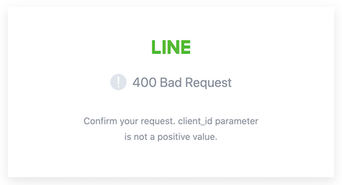
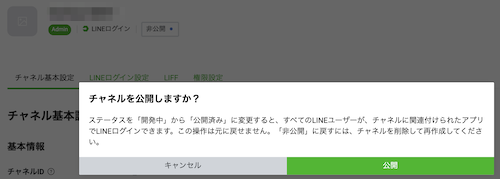
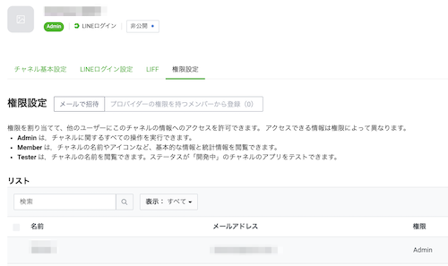
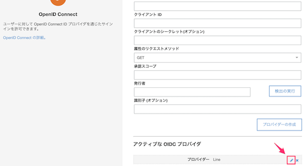
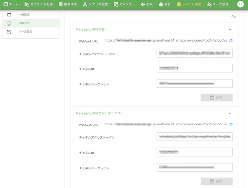
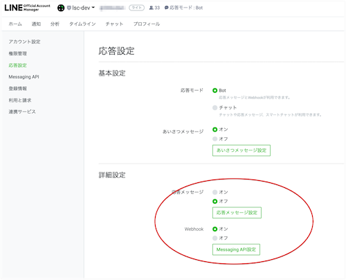

# 環境構築時のトラブルシューティング 

## 目次
- [セグメント配信：セグメント配信がエラーになる](#セグメント配信セグメント配信がエラーになる)
- [帳票作成：作成した帳票（LIFF）のURLにアクセスしたときにAccessDeniedが発生する](#帳票作成作成した帳票liffのurlにアクセスしたときにaccessdeniedが発生する)
- [帳票作成：作成した帳票（LIFF）のURLにアクセスしたときに400 BadRequestとなる](#帳票作成作成した帳票liffのurlにアクセスしたときに400-badrequestとなる)
- [帳票作成：LINEログインのチャネル情報を変更したい](#帳票作成lineログインのチャネル情報を変更したい)
- [シナリオ設定：チャットボットが設定したシナリオ通りに反応しない](#シナリオ設定チャットボットが設定したシナリオ通りに反応しない)
- [セグメント配信、シナリオ設定： Messaging APIのチャネル情報を変更したい](#セグメント配信シナリオ設定-messaging-apiのチャネル情報を変更したい)
- [初期構築： 「Template format error: Unrecognized resource types: [AWS::ses::ReceiptRule]」 が発生する](#初期構築-template-format-error-unrecognized-resource-types-awssesreceiptrule-が発生する)
- [初期構築： 「Error: PythonPipBuilder:ResolveDependencies」 が発生する](#初期構築-error-pythonpipbuilderresolvedependencies-が発生する)

## セグメント配信：セグメント配信がエラーになる

### チェック項目
#### A. Messaging API チャネルが正しく作成されているか確認 
- 参考）　[Messaging API チャネルを作成 - チャネルの作成](./LINE_DEVELOPERS_SCENARIO.md#1-2-messaging-api-チャネルの作成)

#### B. システム設定＞LINE設定の値が正しいか確認

1. システム設定＞LINE設定より「他の情報」を選択
2. DISTRIBUTION_MSG_CHANNEL_ACCESS_TOKEN、DISTRIBUTION_MSG_CHANNEL_SECRETの値が正しいか確認


3. 値が正しくない場合、以下の手順を実行する

```
1. 現在のシークレットと同期する
./lsc.sh secrets download
./lsc.sh secrets merge

2. json編集
deploy/secrets_manager/環境名.json
```

以下の値を正しく設定する
| No | LINE OA | シークレットキー | 内容 | 備考 |
|:---|:---|:---|:---|:---|
| 1 | 共通 | DISTRIBUTION_MSG_CHANNEL_ACCESS_TOKEN | LINE Messaging APIのチャネルアクセストークン | |
| 2 | 共通 | DISTRIBUTION_MSG_CHANNEL_SECRET | LINE Messaging APIのチャネルシークレット |  |

```
3. 環境の更新
./lsc.sh refresh --secrets
```

#### C. lsc-dynamodb-patternsのバージョンが正しいか確認

1. aws_back/distribution_engine/manager/lambda/package.json の 「lsc-dynamodb-patterns」のバージョンを確認
2. aws_back/distribution_engine/manager/lambda/package-lock.json の 「lsc-dynamodb-patterns」のバージョンが1のバージョンより大きいことを確認
3. 2を満たさない場合、以下の手順を実行する

```
1. aws_back/distribution_engine/manager/lambda/package-lock.json を削除
2. 次のコマンドを実行する
./lsc.sh distribution sam fresh
```

## 帳票作成：作成した帳票（LIFF）のURLにアクセスしたときにAccessDeniedが発生する

### チェック項目
#### A. LINEログイン チャネルが正しく作成されているか確認  
- 参考）　[LINEログイン チャネルを作成 - チャネルの作成](./LINE_DEVELOPERS_SURVEY.md#1-2-line%E3%83%AD%E3%82%B0%E3%82%A4%E3%83%B3-%E3%83%81%E3%83%A3%E3%83%8D%E3%83%AB%E3%82%92%E4%BD%9C%E6%88%90)

#### B. LINEログイン チャネルのLIFFアプリケーションが正しく作成されているか確認  
- 参考）　[LINEログイン チャネルを作成 - LIFFアプリケーションの作成](./LINE_DEVELOPERS_SURVEY.md#1-2-line%E3%83%AD%E3%82%B0%E3%82%A4%E3%83%B3-%E3%83%81%E3%83%A3%E3%83%8D%E3%83%AB%E3%82%92%E4%BD%9C%E6%88%90)

#### C. A、B共に作成済みの状態でAccessDeniedが発生する場合、以下の手順を実行する  

```
1. 現在のシークレットと同期する
./lsc.sh secrets download
./lsc.sh secrets merge

2. json編集
deploy/secrets_manager/環境名.json
```

以下の値を正しく設定する
| No | LINE OA | シークレットキー | 内容 | 備考 |
|:---|:---|:---|:---|:---|
| 1 | 共通 | VUE_APP_LIFF_ID | LIFF アプリケーションのLIFF ID | |
| 2 | 共通 | SURVEY_LINELOGIN_CHANNEL_ID | LINEログインのチャネルID | |
| 3 | 共通 | SURVEY_LINELOGIN_CHANNEL_SECRET | LINEログインのチャネルシークレット | |

```
3. CloudFormationのスタックにシークレット値を反映
./lsc.sh survey fresh
```

## 帳票作成：作成した帳票（LIFF）のURLにアクセスしたときに400 BadRequestとなる 



### チェック項目
#### A. LINEログイン チャネルが公開されているか確認 

LINEログイン チャネルが非公開の場合、以下のいずれかの操作を行ってください  
  
1. 公開する  
  
2. 権限設定にてLINEログインするユーザーを追加する  


#### B. 「Confirm your request. client_id parameter is not positive value」エラーが表示されている場合、以下の手順を実行する 

```
1. 現在のシークレットと同期する
./lsc.sh secrets download
./lsc.sh secrets merge

2. json編集
deploy/secrets_manager/環境名.json
```

以下の値を正しく設定する
| No | LINE OA | シークレットキー | 内容 | 備考 |
|:---|:---|:---|:---|:---|
| 1 | 共通 | VUE_APP_LIFF_ID | LIFF アプリケーションのLIFF ID | |
| 2 | 共通 | SURVEY_LINELOGIN_CHANNEL_ID | LINEログインのチャネルID | |
| 3 | 共通 | SURVEY_LINELOGIN_CHANNEL_SECRET | LINEログインのチャネルシークレット | |

```
3. シークレット反映
./lsc.sh secrets update

4. CloudFormationのスタックにシークレット値を反映
./lsc.sh survey fresh
```

##### deploy/secrets_manager/環境名.json：　VUE_APP_UNUSED_COGNITO: "0"の場合、以下の手順を実行する

1. Amazon Cognitoの「ユーザープールの管理」にアクセスする
2. 「環境名-liff-users」を選択する
3. 左メニューの「フェデレーション」 > 「IDプロバイダ」を選択する
4. 「OpenID Connect」を選択する
5. 「アクティブな OIDC プロバイダ」にある「プロバイダー Line」の編集を選択する



6. 以下の情報を入力して「プロバイダの更新」ボタンをタップする

| No | 項目名 | 内容 | 備考 |
|:---|:---|:---|:---|
| 1 | クライアント ID | LINEログインのチャネルID | |
| 2 | クライアントのシークレット | LINEログインのチャネルシークレット | |


参考）
[3. SurveyでAWS Cognitoを利用しない認証方式の設定方法](./LINE_DEVELOPERS_SURVEY.md#3-surveyでaws-cognitoを利用しない認証方式の設定方法)

## 帳票作成：LINEログインのチャネル情報を変更したい
[こちら](#b-confirm-your-request-client_id-parameter-is-not-positive-valueエラーが表示されている場合以下の手順を実行する)の手順を参照

## シナリオ設定：チャットボットが設定したシナリオ通りに反応しない

### チェック項目
#### A. Messaging API チャネルが正しく作成されているか確認 
- 参考）　[Messaging API チャネルを作成 - チャネルの作成](./LINE_DEVELOPERS_SCENARIO.md#1-2-messaging-api-チャネルの作成)

#### B. システム設定＞LINE設定のMessaging APIのチャネル情報が正しくない場合、値を修正して保存する




#### C. LINE Official Account Managerの応答設定にて、「応答メッセージ」をオフ、「Webhook」をオンに設定
- 参考）　[LINE Official Account Managerの応答設定](./LINE_DEVELOPERS_SCENARIO.md#1-4-line-official-account-manager%E3%81%AE%E5%BF%9C%E7%AD%94%E8%A8%AD%E5%AE%9A)



## セグメント配信、シナリオ設定： Messaging APIのチャネル情報を変更したい

```
1. 現在のシークレットと同期する
./lsc.sh secrets download
./lsc.sh secrets merge

2. json編集
deploy/secrets_manager/環境名.json
```

以下の値を正しく設定する
| No | LINE OA | シークレットキー | 内容 | 備考 |
|:---|:---|:---|:---|:---|
| 1 | 本番/ステージング/開発 | LINEMESSAGING_CHANNEL_ACCESS_TOKEN | LINE Messaging APIのチャネルアクセストークン | |
| 2 | 本番/ステージング/開発 | LINEMESSAGING_CHANNEL_ID | LINE Messaging APIのチャネルID | |
| 3 | 本番/ステージング/開発 | LINEMESSAGING_CHANNEL_SECRET | LINE Messaging APIのチャネルシークレット | |
| 4 | サンドボックス | SB_LINEMESSAGING_CHANNEL_ACCESS_TOKEN | LINE Messaging APIのチャネルアクセストークン | ステージング/開発の場合、1と同じ値 |
| 5 | サンドボックス | SB_LINEMESSAGING_CHANNEL_ID | LINE Messaging APIのチャネルID | ステージング/開発の場合、2と同じ値 |
| 6 | サンドボックス | SB_LINEMESSAGING_CHANNEL_SECRET | LINE Messaging APIのチャネルシークレット | ステージング/開発の場合、3と同じ値 |
| ７ | 共通 | DISTRIBUTION_MSG_CHANNEL_ACCESS_TOKEN | LINE Messaging APIのチャネルアクセストークン | 1と同じ値 |
| ８ | 共通 | DISTRIBUTION_MSG_CHANNEL_SECRET | LINE Messaging APIのチャネルシークレット | 3と同じ値 |

```
3. 環境の更新
./lsc.sh refresh --secrets
```

## 初期構築： 「Template format error: Unrecognized resource types: [AWS::ses::ReceiptRule]」 が発生する

### チェック項目
#### A. AWS CLI のバージョンが2.0以上になっているか確認

```
1. AWS CLIバージョンを確認
$ aws --version

2. AWS CLIバージョンが1系の場合、バージョンアップする

3. 初期構築のコマンドを実行する
$ ./lsc.sh setup
```

参考） [AWS CLI のインストール、更新、アンインストール](https://docs.aws.amazon.com/ja_jp/cli/latest/userguide/cli-chap-install.html)

## 初期構築： 「Error: PythonPipBuilder:ResolveDependencies」 が発生する

### チェック項目
#### A. pipのwheelパッケージがインストールされているか確認

```
1. pipのwheelパッケージがインストールされているか確認
$ pip list

2. pipの必要なパッケージがインストールされていない場合、インストールする
$ pip install wheel setuptools

3. 初期構築のコマンドを実行する
$ ./lsc.sh setup
```

#### B. Aでも解決しない場合
[Docker](https://www.docker.com/products/docker-desktop)をインストールして起動し、`--useContainer`オプションを付けて実行してください。
   
```bash
$ ./lsc.sh setup --useContainer
```
