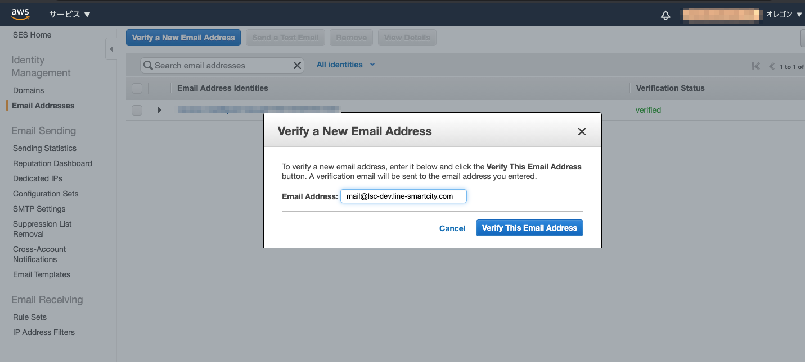

# SESの受信メールアドレス設定

## メールアドレスの追加

環境構築のコマンド実施後にAmazon SES （以下、「SES」）の設定を実施してください。

[SES コンソール](https://us-west-2.console.aws.amazon.com/ses/home?region=us-west-2#verified-senders-email:)で設定をします。必ずリージョンが「オレゴン」になっていることを確認してください。

* 「Verify a New Email Address」ボタンをクリック

* 「Email Address」入力欄にメールアドレスを入力し「Verify This Email Address」をクリック

* 追加するメールアドレスは2種類あります。

  * [1. 損傷報告のメールアドレス設定](#1-損傷報告のメールアドレス設定)

  * [2. 外部配信設定でメール連携をする場合のメールアドレス設定](#2-外部配信設定でメール連携をする場合)（セグメント配信にて、外部配信を利用する場合のみ設定）



### 1. 損傷報告のメールアドレス設定

お持ちのメールアドレスを入力し、「Verify This Email Address」をクリックします。

※ここで入力するメールアドレスは、[損傷報告先メールアドレスの設定](../README.md#4-損傷報告先メールアドレスの設定)で設定するメールアドレスである必要があります。

メールアドレスに届いた認証メール内のリンクをクリックして認証完了です。

### 2. 外部配信設定でメール連携をする場合

上記「Email Address」入力欄に、[シークレット修正](../README.md#2-設定情報の反映)で設定した`DISTRIBUTION_TRIGGER_EMAIL`のメールアドレスを入力し、「Verify This Email Address」をクリックします。

「Verify This Email Address」をクリック後、認証メールがCloudWatchへ転送されますので、そちらを確認する必要があります。

[CloudWatch Logs インサイト](https://ap-northeast-1.console.aws.amazon.com/cloudwatch/home?region=ap-northeast-1#logsV2:logs-insights)にアクセスします。

* (1)：ロググループは`/aws/lambda/環境名-distribution-manager`を選択

* (2)：クエリは下記を入力

  * ```
    fields @body
    | sort @timestamp desc
    | filter @message like /Email Address Verification/
    | parse @message "body\": \"*from" as @body
    ```

* (3)：「クエリの実行」をクリック

* (4)：レコードが表示されたら「結果をエクスポート」をクリックし、「テーブルをクリップボードにコピー (CSV)」をクリック


レコードがクリップボードにコピーされますので、以下のようにテキストエディタ等に貼り付けます。

6行目付近に記載の認証リンクにアクセスすることで、メール認証が完了します。


