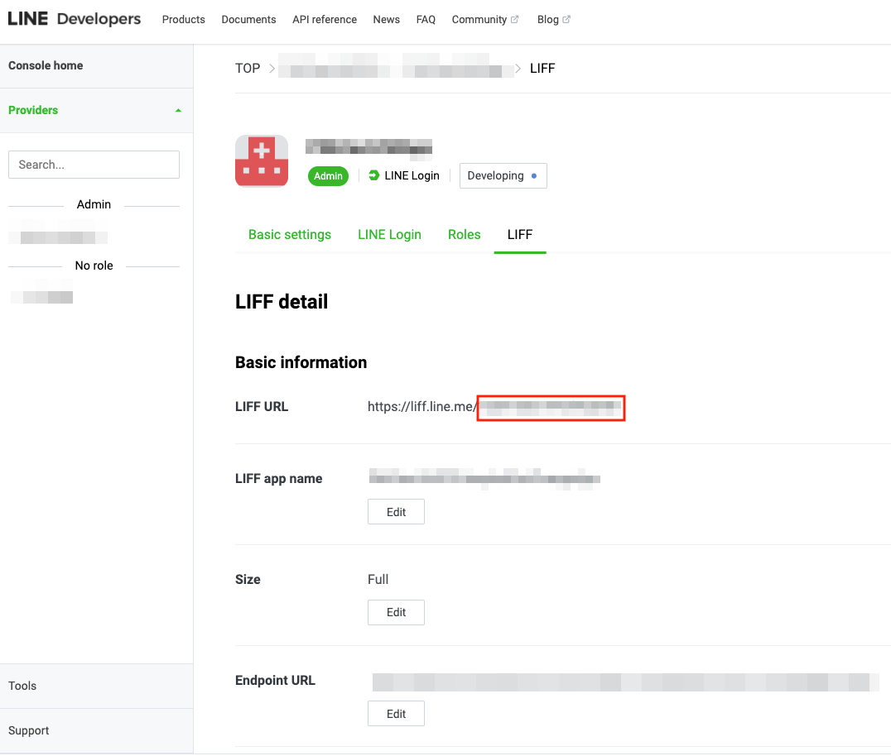
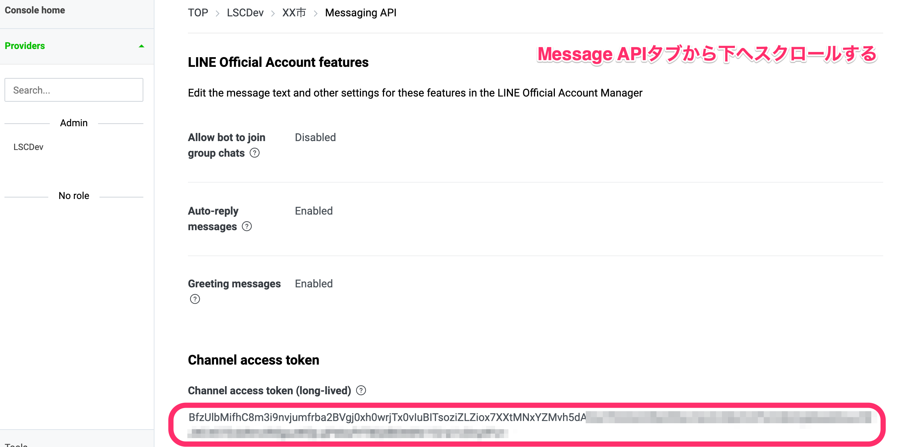

# LIFFについて

## LINE公式アカウントマネージャ(OAM)とLINE developerで設定

### LINE DevelopersでProviderを作成
[LINE Developers](https://developers.line.biz/ja/)にログインします

1. プロバイダーの作成
* 作成ボタンから、新規プロバイダーの作成を行う
    * 以下項目を入力

    |  項目         | 入力内容           | 説明                    　　　　|
    |---------------|-------------------|-------------------------------|
    | プロバイダー名 | 任意               | 管理するチャネルが分かる名前　 |

2. LINE Login channel作成
    * チャネル種類の選択でLINEログインを選択
    * 以下項目を入力

    |  項目         | 入力内容           | 説明                    　　　　|
    |---------------|-------------------|-------------------------------|
    | チャネル名   　| 任意               | 作成するチャネルの名前　　　　　 |
    | チャネル説明 　| 任意               | 作成するチャネルの説明　　　　　 |
    | アプリタイプ   | ウェブアプリ        | 作成するチャネルのアプリタイプ　 |
    | メールアドレス | 自分のメールアドレス | メールアドレス                 |

    * 利用規約に同意し、作成ボタンをクリック
    * 補足
        * チャネルアイコン, プライバシーポリシーURL, サービス利用規約URLは任意で入力する

    * 作成したチャネルの設定画面から、LINE Login タブで、Web app の Callback URL を設定
        * コールバックURLから編集をクリックして編集可能にする
        * 「CloudFormation Output の `ApiRootProdURL`」+ `/liff` がURLになる
            * 例) https://XXXXXXXXXX.execute-api.ap-northeast-1.amazonaws.com/Prod/liff
        * LIFF タブで、LIFF applicationを作成
            * LIFFタブを選択し、追加をクリック
            * 以下項目を入力

            |  項目      　　　| 入力内容                        | 説明                    　　　 |
            |-----------------|--------------------------------|-------------------------------|
            | LIFFアプリ名     | 任意                           | 作成するLIFFの名前　　　　       |
            | サイズ           | 任意                           | 表示するLIFFのサイズ　　　　     |
            | エンドポイントURL | `ApiRootProdURL` + /linelogin | 例）https://XXXXXXXXXX.execute-api.ap-northeast-1.amazonaws.com/Prod/linelogin |
            | Scopes           | profile, openid               | LIFFアプリの動作に必要なスコープ |
            | ボットリンク機能  | off                            | アプリにログインするときに、LINE公式アカウントを友だち追加するオプションを表示する |

3. Messaging API Channel を作成
* チャンルの作成
    * トップから対象のプロバイダーを選択する
    * 新規チャンル作成より、Messaging APIを選択
    * 以下項目を入力

    |  項目         | 入力内容           | 説明                    　　　　|
    |---------------|-------------------|-------------------------------|
    | チャンル名   　| 任意               | 作成するチャネルの名前　　　　　 |
    | チャンル説明　 | 任意               | 作成するチャネルの説明　　　　　 |
    | 大業種        | 任意                | 作成するチャネルの大業種   　   |
    | 小業種        | 任意                | 作成するチャネルの小業種 　     |
    | メールアドレス | 自分のメールアドレス | メールアドレス                 |

    * 各利用規約に同意し、作成ボタンをクリック
    * 補足
        * チャネルアイコン, プライバシーポリシーURL, サービス利用規約URLは任意で入力する
* Messaging API タブで チャネルアクセストークン を発行
    * Messaging API タブに移動
    * チャネルアクセストークンにある「発行」ボタンより、チャネルアクセストークンを発行する

4. [LINE Official Account Manager](https://manager.line.biz/) で ホームメニューから　リッチメニューを選択し、作成
    * トップページから、対象のMessaging API Channelを選択
    * ホームメニューから　リッチメニューを選択
    * 「作成」ボタンをクリック
    * 以下項目を入力

    |  項目                   | 入力内容                          | 説明                    　　　　            |
    |------------------------|-----------------------------------|--------------------------------------------|
    | タイトル                | 任意                              | リッチメニューの名前　　　　                 |
    | ステータス　　          | オン                               | リッチメニュー表示ステータス　　　　         |
    | メニューバーテキスト     | メニュー                           | 下部に表示するメニューバーのテキスト         |
    | メニューのデフォルト表示 | 表示する                           | メニューのデフォルト表示設定                 |
    | コンテンツ設定          | テンプレート選択⇒1選択のテンプレート | リッチメニューのテンプレート                 |
    | タイプ                  | リンク                            | リッチメニューのタイプ(1. で作成した LIFF application の LIFF URL を設定) |

    * 「保存」ボタンをクリックして、リッチメニュー設定を完了する

5. Secrets Manager設定項目を控える
* Secrets Managerの設定に必要な項目を控えておく（後ほど利用するため）
    * LIFF ID
        * 
    * Messaging API トークン
        * 
    * チャネルシークレット
        * 2.で作成したMessaging APIのチャネル基本設定画面にある、「チャネルシークレット」

* 以上で「LIFF」についての設定が完了です。以降の手順は、詳細は[開発環境構築](../docs/CICD.md)の7. Secrets Manager設定の変更を参照してください。