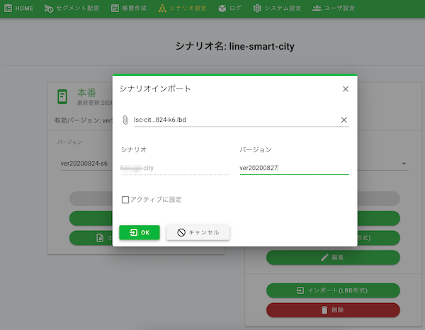

# 管理画面 | シナリオ設定

## 目次
  - [1. シナリオ設定](#1-シナリオ設定)
    - [1-1. シナリオのインポート](#1-1-シナリオのインポート)
    - [1-2. バージョン切替 （サンドボックス）](#1-2-バージョン切替-サンドボックス)
    - [1-3. バージョン切替 （本番）](#1-3-バージョン切替-本番)
  - [2. LINE公式アカウントの設定](#2-line公式アカウントの設定)
    - [2-1. LINE Official Account Managerにログイン](#2-1-line-official-account-managerにログイン)
    - [2-2. リッチメニューの確認](#2-2-リッチメニューの確認)
    - [2-3. 友だち追加](#2-3-友だち追加)
    - [2-4. プロフィール設定および公開](#2-4-プロフィール設定および公開)
    - [2-5. 設定 アカウントやプランの設定について](#2-5-設定-アカウントやプランの設定について)

## 1. シナリオ設定

1-1.〜1-3.の手順にて、LINE公式アカウントの利用準備を行います。

### 1-1. シナリオのインポート
* [LINE Bot Designer](https://developers.line.biz/ja/services/bot-designer/) のシナリオ(.lbdファイル)を以下よりダウンロード
    * https://share.lsc.line-smartcity.com/lbd/govtech-demo.lbd
* 管理画面にログインする
* メニューより「シナリオ設定」を選択
* サンドボックスの「インポート（LBD形式）」ボタンをクリック
* 以下項目を入力

| 項目 | 説明 | 入力内容 |
|---|---|---|
| LBDファイル | シナリオ（.lbdファイル）  | ローカルより選択されたシナリオ（.lbdファイル） |
| シナリオ | 適用されるシナリオ名 | LBDファイルをアップロードすると自動で反映されます |
| バージョン | 適用するバージョン | 任意 |
| アクティブに設定 | シナリオを即座に適用するかどうかのチェック | 任意 |

* 「OK」ボタンをクリックして、シナリオインポートを完了する

* 

### 1-2. バージョン切替 （サンドボックス）
* サンドボックスのバージョンを選択
* 有効バージョンと異なるバージョンを選択
* 「有効にする」ボタンをクリックして、選択したバージョンを有効にする

### 1-3. バージョン切替 （本番）
* 本番のバージョンを選択
* 有効バージョンと異なるバージョンを選択
* 「有効にする」ボタンをクリックして、選択したバージョンを有効にする

## 2. LINE公式アカウントの設定
### 2-1. LINE Official Account Managerにログイン
* [LINE Official Account Manager](https://manager.line.biz/)にログインします
* アカウントリストより、[LINE Developers](https://developers.line.biz/ja/) で作成したMessaging API Channelの「アカウント」を選択

### 2-2. リッチメニューの確認
* ホームメニューから「リッチメニュー」を選択
    * 詳細は「[リッチメニュー ](https://www.linebiz.com/jp/manual/OfficialAccountManager/rich-menus/create/)」を参照

### 2-3. 友だち追加
* ホームメニューから「友だち追加」を選択
    * 詳細は「[友だち追加](https://www.linebiz.com/jp/manual/OfficialAccountManager/gain-friends/overview/)」を参照

### 2-4. プロフィール設定および公開
* プロフィールメニューを選択
    * 詳細は「[プロフィール](https://www.linebiz.com/jp/manual/OfficialAccountManager/account-page/settings/)」を参照

### 2-5. 設定 アカウントやプランの設定について
* 設定を選択
    * 詳細は「[設定 アカウントやプランの設定について](https://www.linebiz.com/jp/manual/OfficialAccountManager/settings/overview/)」を参照
    * プランについては「[料金プラン](https://www.linebiz.com/service/line-official-account/plan/)」を参照
